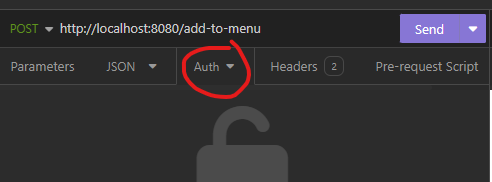
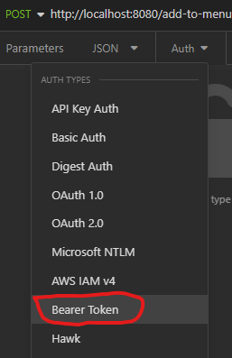
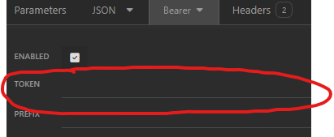

# Airbean-API

## HTTP anrop

## GET menu - http://localhost:8080/menu

## GET info - http://localhost:8080/info

## POST register account - http://localhost:8080/register
 JSON body:
 {
	    "username": "username",
	    "password": "password",
	    "email": "email@email.com",
     "role": "user/admin"
 }

## POST login - http://localhost:8080/login
 JSON body:
 {
	    "username": "username",
	    "password": "password"
 }

## PUT update account info - http://localhost:8080/update-account
 JSON body:
 {
     "userId": "userId", (required)
	    "username": "username", (skrivs in body om man vill ändra det)
	    "password": "password", (skrivs in body om man vill ändra det)
	    "email": "email@mail.com" (skrivs in body om man vill ändra det)
 }

## POST add to cart by product id - http://localhost:8080/cart/add/:userID/:id

## DELETE from cart by product id - http://localhost:8080/cart/remove/:userID/:id

## GET cart by userId - http://localhost:8080/cart?userId=:userId

## DELETE whole cart - http://localhost:8080/cart/clear/:userId

## POST create order - http://localhost:8080/order/create/:userId

## GET order confirmation - http://localhost:8080/confirmation/:userId

## GET order history - http://localhost:8080/order-history/:userId

### Om man inte har ett konto och inte vill skapa ett - används 'guest' istället för userId.

## JWT Token

 För att kunna göra POST PUT och DELETE anrop mot menyn och även skapa erbjudanden så behöver användaren en token.
 Föj dessa steg för att se vart det skall skrivas in i Insomnia

 Vid lyckad inloggning får du ett meddelande i Insomnia som består av:
 {
	    "message": "Du är inloggad!",
	    "token": " Din JWT token "
 }
 Kopiera din JWT token och gå dit bilden visar, det är samma på alla anrop.
### Steg 1.

### Steg 2.

### Steg 3.

 Här skall du klistra in din JWT token där bilden visar.
 Hur det skall skrivas i bodyn ses nedan.

### POST add item to menu - http://localhost:8080/add-to-menu
 JSON Body:
 {
     "title": "Title",
     "desc": "Description",
     "price": Number(price)
 }

### DELETE item from menu - http://localhost:8080/delete-from-menu/:id

### PUT update menu item - http://localhost:8080/update-menu-item
 JSON Body:
 {
     "id": "id"
     "title": "Title",
     "desc": "Description",
     "price": Number(price)
 }

### POST new offer - http://localhost:8080/offers
 JSON Body: 
 {
 	"products": ["Exempel", "Exempel"],
 	"offer": Number(price)
 }
